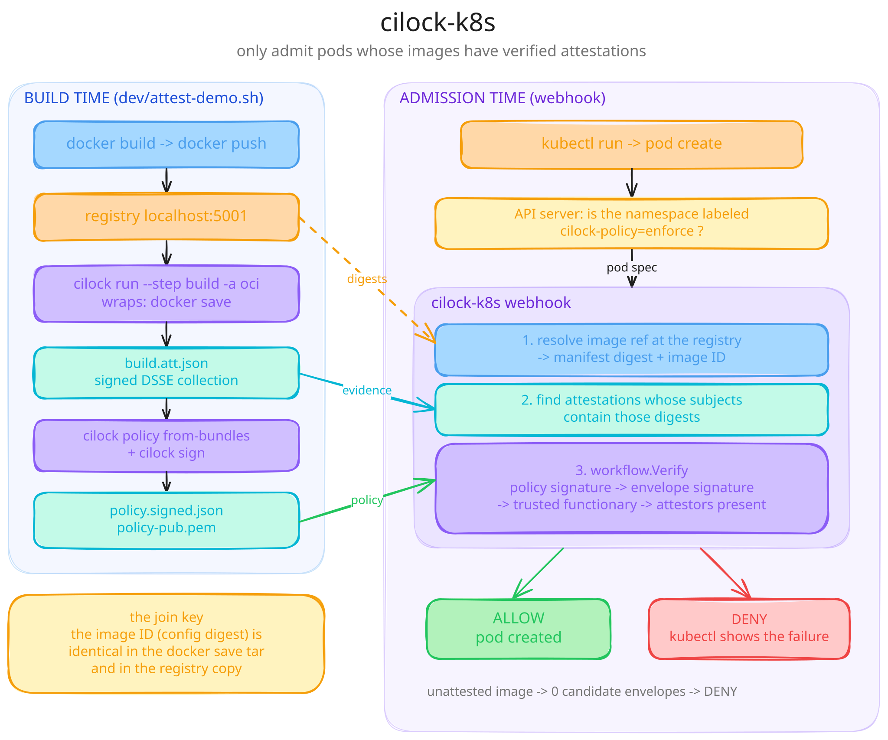

# cilock-k8s

Proof-of-concept Kubernetes validating admission webhook that only admits
pods whose container images have verifiable
[witness](https://witness.dev) / [cilock](https://github.com/aflock-ai/rookery)
attestations.

{ .diagram }

A pod referencing an attested image is admitted; anything else is denied by
the API server with the verification failure as the error message.

## Guides

- **[How it works](how-it-works.md)** — every stage explained: what each
  `dev/` script creates and why, and how admission-time verification works.
- **[Try it yourself](try-it-yourself.md)** — hands-on demo walkthrough
  with expected output, experiments (tampered image, wrong key, unlabeled
  namespace), and troubleshooting.
- **[Use it with your app](use-with-your-app.md)** — attest your own image,
  create and sign your policy, deploy and enforce.

## Quickstart

```bash
git clone https://github.com/manzil-infinity180/cilock-k8s
cd cilock-k8s
make e2e   # kind cluster + registry + attest + deploy + admission test
```

Expected final line:

```
E2E PASSED: attested image admitted, unattested image denied
```

## Source

[github.com/manzil-infinity180/cilock-k8s](https://github.com/manzil-infinity180/cilock-k8s)
— a modernization of [testifysec/judge-k8s](https://github.com/testifysec/judge-k8s)
by Cole Kennedy, rebuilt on the
[cilock / rookery attestation library](https://github.com/aflock-ai/rookery).
